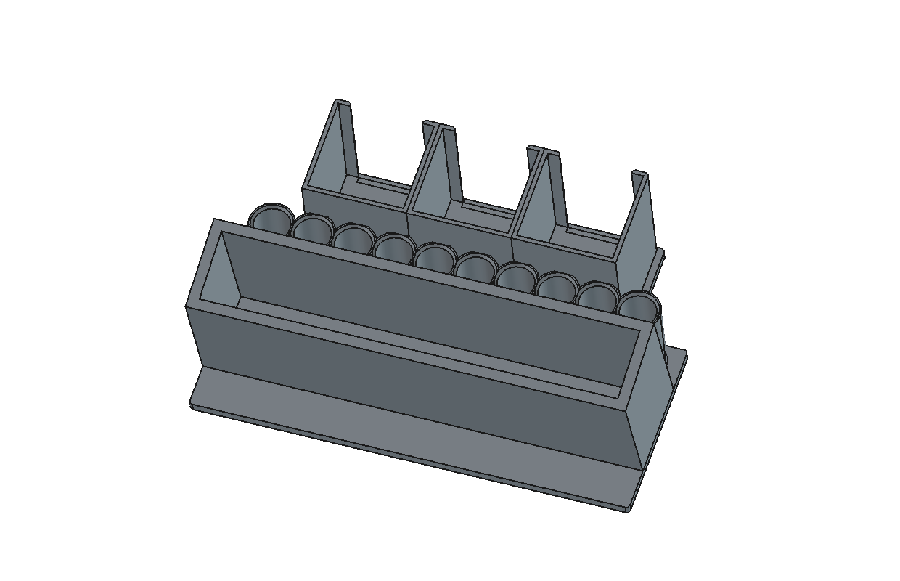

# Free 3D Models

Free, print-ready 3D models — with the parametric scripts that generate them.

Every model here is built by a Python script in [FreeCAD](https://www.freecad.org/)
rather than drawn by hand. Change a number, re-run, and the whole model
rebuilds along with its STEP, STL and 3MF files. Ready-to-print files are
committed, so **you don't need FreeCAD unless you want to change something**.

**Free for personal and commercial use** under the [MIT licence](LICENSE).
Print them, sell them, modify them, put them in a product — no permission
needed and nothing owed.

---

## The models

| Model | What it is | Size | Print | Status |
|---|---|---|---|---|
| **[Whiteboard Caddy](whiteboard-stand/)** | Classroom desk caddy for lap whiteboards, markers and erasers | 244 × 159 × 94 mm | 7–12 h · ~350 g PETG · no supports | ✅ Printed and in use |
| **[Whiteboard Caddy (3-eraser)](whiteboard-stand-3-eraser/)** | Variant with a third eraser bay and no carry handle | 244 × 159 × 94 mm | 7–12 h · ~380 g PETG · no supports | 🧪 Generated and checked, not yet printed |
| **[Socket Organizer](socket-organizer/)** | Modular, interlinking socket holder, metric and SAE, 3/8" and 1/2" drive | 43 × 53 × 21 mm per piece (52 pieces) | ~15–25 min/piece · few g/piece · no supports | 🧪 Generated and checked, not yet printed |

---

### [Whiteboard Caddy](whiteboard-stand/)


A caddy for a small-group classroom table. Lap whiteboards stand in a leaning
channel at the back, dry-erase markers sit cap-up in a merged row of tubes, and
eraser pads stack in open-front boxes. An arched cutout in the back wall is the
carry handle.

Holds **8 lap boards** (9"×12"), **10 markers** and **16 eraser pads**. Prints
in one piece, flat on its base, no supports.

[Details and print files →](whiteboard-stand/README.md)

---

### [Whiteboard Caddy (3-eraser)](whiteboard-stand-3-eraser/)



Same caddy, two changes: a third eraser bay was added, and the carry handle
was removed.

Holds **8 lap boards** (9"×12"), **10 markers** and **24 eraser pads** in
**3 boxes**. Prints in one piece, flat on its base, no supports.

[Details and print files →](whiteboard-stand-3-eraser/README.md)

---

## Safety

These are files, not finished products. A printed part is only as good as the
printer, filament and settings used to make it, and you are responsible for
judging whether what comes off your bed is fit for the job.

- **Not toys.** Nothing here is designed or tested as a children's toy. Small
  or broken-off pieces are a choking hazard for young children.
- **Not food-safe.** FDM prints have layer lines that trap bacteria and are not
  safe for food, drink or anything that goes in a mouth, whatever the filament.
- **Check before loading.** Inspect prints for weak layer adhesion or cracks
  before putting weight on them, and re-check parts that get handled hard.
- **Mind the material.** PLA softens in a hot car or a sunny window. The models
  here specify PETG where heat or toughness matters — substitute knowingly.

Provided as-is, with no warranty — see [LICENSE](LICENSE).

---

## Printing any of these

1. **Print the fit coupon first.** Every model here ships one — a small part
   carrying each critical dimension, so you spend 20 minutes finding out a
   marker is 0.5 mm too tight instead of a whole overnight print.
2. If the coupon fits, print the real thing.
3. If it doesn't, change one number in the script and re-run.

The coupon exists because the tolerances that matter — how a marker sits in a
tube, how a board slides into a channel — depend on the objects *you* own, not
the ones the model was designed around.

---

## Regenerating a model

Needs FreeCAD 1.0 or newer. No other dependencies.

```bash
cd whiteboard-stand/freecad
freecadcmd build_caddy.py
```

On macOS `freecadcmd` lives inside the app bundle:

```bash
/Applications/FreeCAD.app/Contents/Resources/bin/freecadcmd build_caddy.py
```

Every run prints a report and rewrites `exports/`. A full rebuild takes a few
seconds.

---

## What the scripts check

The generators verify their own output. Each run reports:

- **Fit** — a probe solid of every real object (each marker, the board stack,
  the eraser stacks) is pushed through the model. Any intersection means that
  object physically will not fit. This has caught real bugs, including a name
  plate that could not enter its own pocket.
- **Structural** — minimum wall and web thicknesses at the places that break.
- **Printability** — downward-facing surfaces, split into true flat bridges
  and harmless progressive overhang.
- **Mesh health** — B-rep self-intersection, closed shell, and non-manifold
  tessellation, since a slicer will reject a mesh that fails these.

If a check fails, fix the script rather than running the output through a mesh
repair tool.

---

## Repository layout

Each model lives in its own folder and follows the same shape:

```
<model-name>/
  README.md              what it is, what to print, how to change it
  images/                renders used in the READMEs
  freecad/
    build_<name>.py      the generator, re-runnable and self-checking
    <name>.FCStd         FreeCAD document
    exports/             STEP + STL + 3MF, committed and ready to slice
```

---

## Contributing

Issues and pull requests welcome — especially fit corrections for different
brands of marker, board thickness, or eraser size, since those are the numbers
most likely to be wrong for someone else's supplies.
