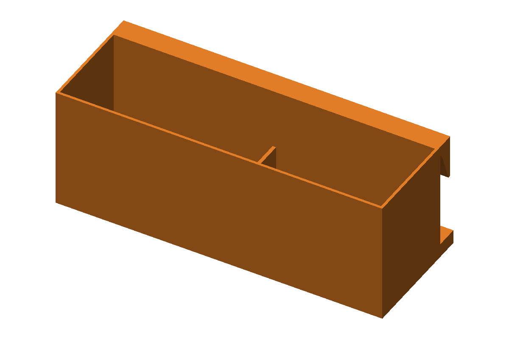
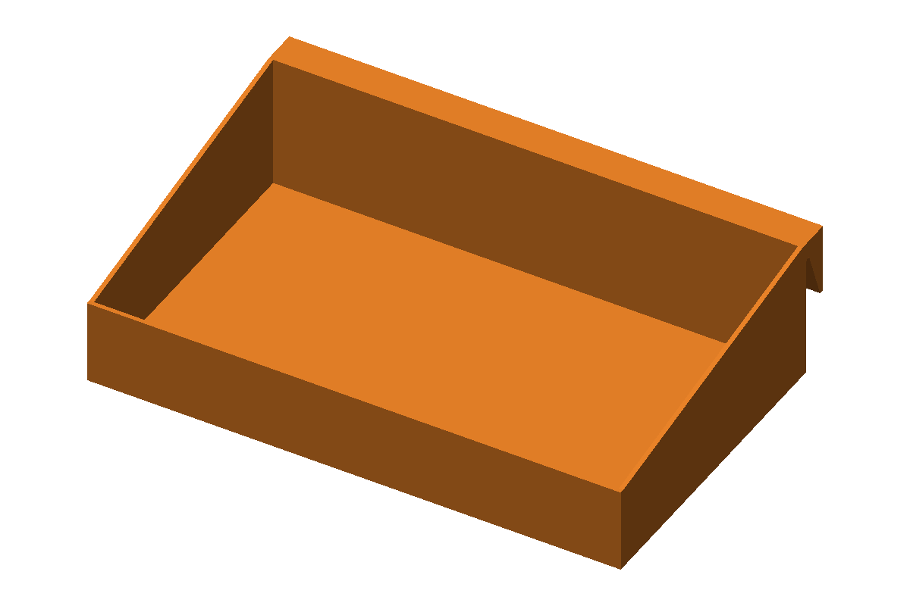
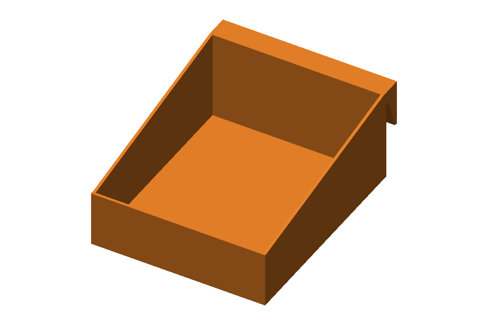
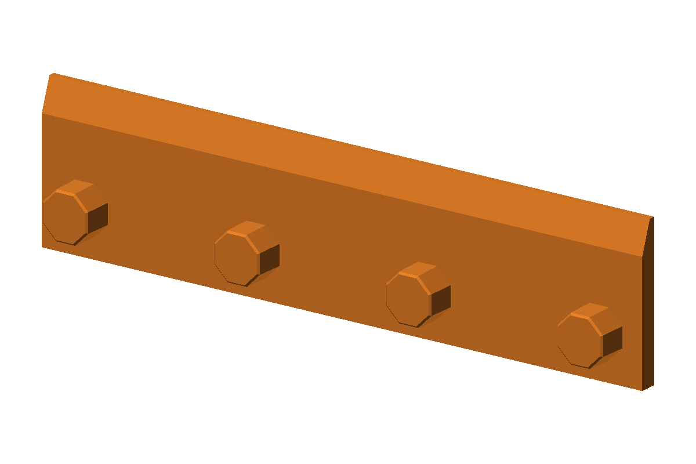

# French-Cleat Bins

One-piece wall bins for a Multiboard French cleat, plus the rail they hang on.
The rail is an exact reproduction of the rail from the *Multiboard French
Cleat Storage Bins* set: same plate, same bevel, and the same octagonal
bosses on the same unit centres. The same Multiboard snaps hold it, and that
set's bins hang on it too. The bins use that set's hook. Unlike its bins,
though, each one here prints as a single part, with no side panel to glue on.

**Screw bin** holds **2 × 1 lb boxes of 3" deck screws** (the common
3.5" × 2" × 5.5" retail box). They stand upright, side by side, with the
lids clear of the rim so they open where they hang.

**Shallow basket** is the same width but twice as deep off the wall. It
holds loose parts. The back is 50 mm high and slopes down to a 30 mm front,
so you can reach in easily.

**Half-width basket** is the same basket at half the width (95 mm). Two of
them take up the same wall space as one full basket.

**Cleat rails** come in two lengths, each hidden behind its bin:
- **7 units (175 mm)** for the full-width screw bin and basket. Two half
  baskets side by side can also share one.
- **3 units (75 mm)** for a single half basket.

All three bins print upright on their floor. The only support either one needs
is a thin strip under the hook lip. The rail prints flat with no supports.

| | |
|---|---|
| Size | Screw bin 189 × 71 × 70 mm · basket 189 × 124 × 50 mm · half basket 95 × 124 × 50 mm · rails 175 or 75 × 43 × 13 mm |
| Print time | Screw bin 5–7 h · basket 4–6 h · half basket 2–3 h · rails ~30–60 min |
| Material | ~160 g / ~150 g / ~85 g PETG; rails ~50 g / ~22 g (upper bounds, from solid volume; the slicer will show less) |
| Supports | Bins: hook lip only (tree supports, build plate only). Rail: none |
| Bed needed | 200 × 130 mm or larger |
| Status | Generated and checked (fit/structural/printability/mesh); not yet printed |

## Print these

- **[`freecad/exports/fit_coupon.3mf`](freecad/exports/fit_coupon.3mf)**:
  print this first. It takes about 40 minutes and uses a few grams. It has
  three pieces:
  - **One unit of rail with one boss.** Push a Multiboard snap onto the boss
    and mount it on your board.
  - **A 25 mm slice of the hook**, printed on its side with no supports. The
    hook is identical on every bin. Hang it on the rail piece and check that
    it drops in and sits flat.
  - **A ring the size of one screw-bin compartment.** Slide it over one of
    *your* screw boxes, since box sizes vary by brand.
- **[`freecad/exports/cleat_rail.3mf`](freecad/exports/cleat_rail.3mf)**:
  the 7-unit rail, for the full-width bins. Print it front face down,
  bosses up, and mount it with Multiboard snaps.
- **[`freecad/exports/cleat_rail_half.3mf`](freecad/exports/cleat_rail_half.3mf)**:
  the 3-unit rail, for the half basket. Print and mount it the same way.
- **[`freecad/exports/screw_bin.3mf`](freecad/exports/screw_bin.3mf)**:
  the screw bin. Print it upright, as exported.
- **[`freecad/exports/shallow_basket.3mf`](freecad/exports/shallow_basket.3mf)**:
  the basket. Print it upright, as exported.
- **[`freecad/exports/shallow_basket_half.3mf`](freecad/exports/shallow_basket_half.3mf)**:
  the half-width basket. Print it upright, as exported.

STL and STEP versions are alongside them in
[`freecad/exports/`](freecad/exports/).

**Hanging a bin:** tilt the bottom away from the wall and drop the hook over
the top of the rail. Then swing the bottom in. On the screw bin, the three foot pads
will come to rest against the board. You can't lower it straight down,
because the foot pads would hit the bottom edge of the rail. The basket's back
rests on the full height of the rail, so it has no foot.

## Change it

Everything is driven from the top of
[`freecad/build_cleat_bins.py`](freecad/build_cleat_bins.py):

- **`PARAMS`**: settings shared by every part, including the cleat and rail
  geometry.
- **`VARIANTS`**: one entry per bin. Add an entry to get a new bin.
- **`RAILS`**: one entry per rail length, in 25 mm units, plus the bin it
  sits behind. Every run checks that each rail stays hidden behind its
  bin.

Some common fixes:

- **Ring too tight or loose:** change `box_w` / `box_d` or the
  `box_clear_*` values.
- **Hook won't seat:** raise `slot_clear` a little (0.1–0.2 mm).

Re-run the script and every output file rebuilds.

**[Design notes and the cleat geometry →](freecad/README.md)**

---

Printed parts are not toys and are not food-safe; see the
[safety notes](../README.md#safety). Provided as-is, with no warranty.

Part of a collection of free 3D models — [see them all](../README.md).
MIT licensed; free for personal and commercial use.
