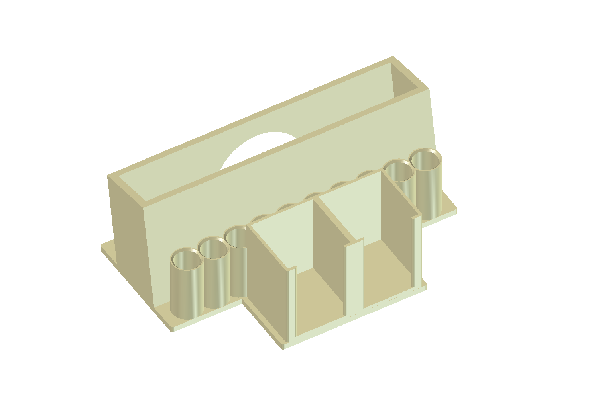

# Whiteboard Caddy

A classroom desk caddy for a small-group table: lap whiteboards stand in a
leaning channel at the back, dry-erase markers sit cap-up in a row of tubes,
and eraser pads stack in open-front boxes. An arched cutout in the back wall
serves as a carry handle.

As configured it holds **8 lap boards** (9"×12"), **10 markers** and
**16 eraser pads**. Prints in one piece, flat on its base, with no supports.

| | |
|---|---|
| Size | 244 × 159 × 94 mm |
| Print time | ~20–28 h |
| Material | ~380–450 g PETG |
| Supports | None |
| Bed needed | 256 × 256 mm or larger |
| Status | Printed and in classroom use |

## Print these

- **[`freecad/exports/fit_coupon.3mf`](freecad/exports/fit_coupon.3mf)** —
  print this first. ~20 minutes, ~12 g. It carries one marker tube, a slice of
  the board channel and an eraser-pad gauge at full size, so you find out
  whether *your* markers and boards fit before committing a day of print time.
- **[`freecad/exports/whiteboard_caddy.3mf`](freecad/exports/whiteboard_caddy.3mf)** —
  the caddy. One per plate; it fills the bed.

STL and STEP versions are alongside them in
[`freecad/exports/`](freecad/exports/).

## Change it

Everything is driven by a parameter dict at the top of
[`freecad/build_caddy.py`](freecad/build_caddy.py) — marker diameter, board
count and thickness, eraser dimensions, number of boxes, whether to include
name plates. Change a number, re-run, and every output file rebuilds.

**[Full documentation, tolerances, and design notes →](freecad/README.md)**

---

Printed parts are not toys and are not food-safe; see the
[safety notes](../README.md#safety). Provided as-is, with no warranty.

Part of a collection of free 3D models — [see them all](../README.md).
MIT licensed; free for personal and commercial use.
